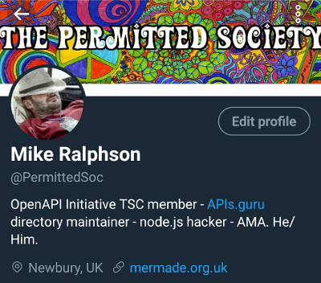
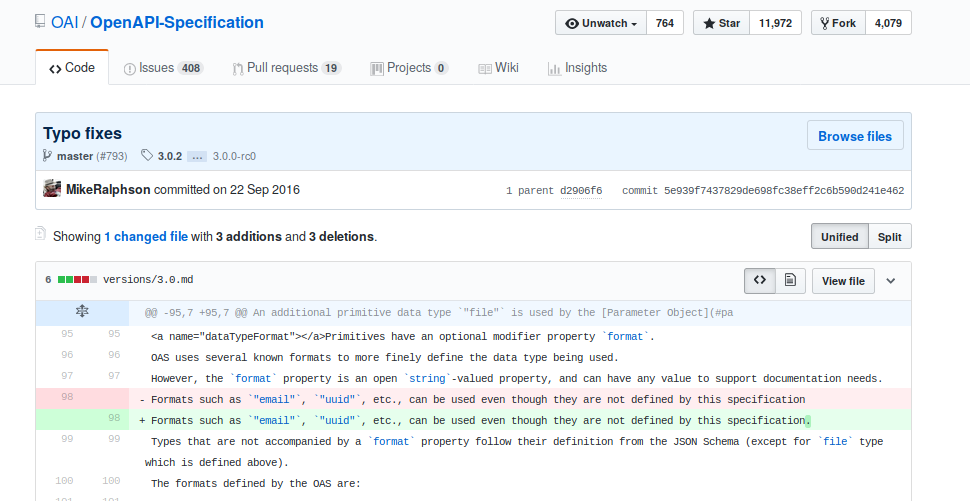
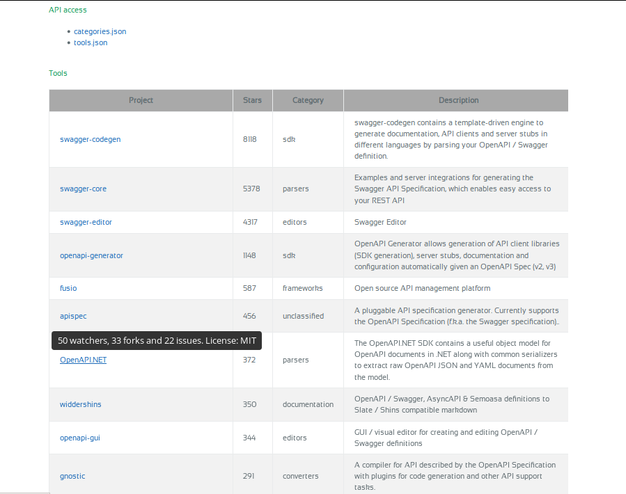
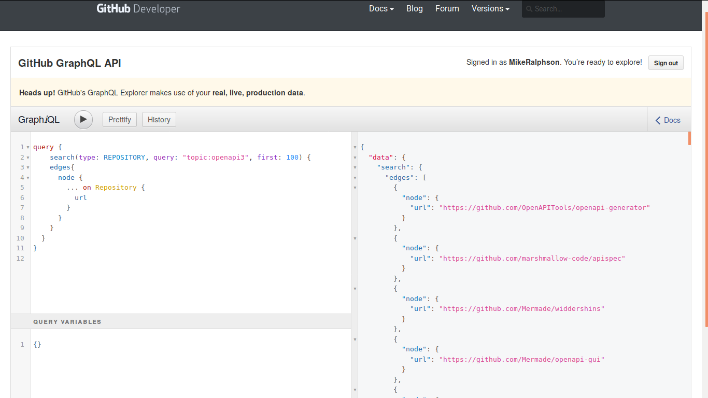
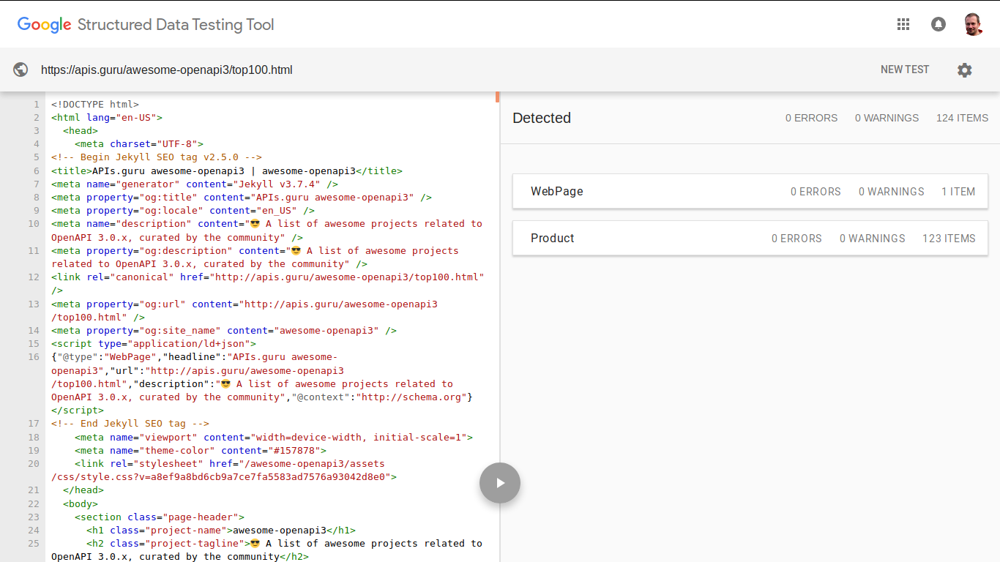
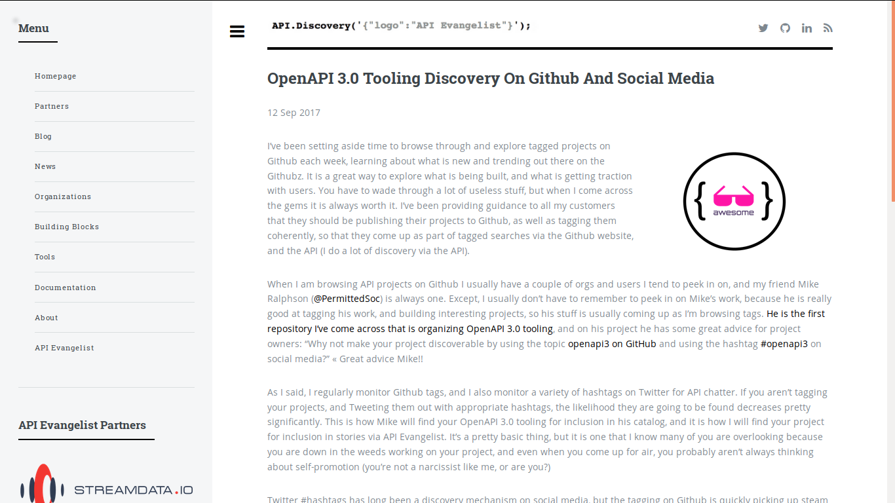
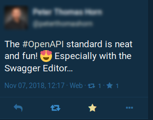

---

# OpenAPI Tool Discovery

Note:

First presented at API Days Paris, December 12th 2018.

---

---

## How I got into all this

Note:

First commit just over 2 years ago, a missing full-stop! I thought it was the
warm welcome each PR received which gave me confidence and made me feel 
appreciated, but checking back it turns out to have been the ruthless
efficiency which must have appealed.

---

## Finding OAS-related tools

TODO history, swagger.io, IMPLEMENTATIONS.md, submission model

---

---

### OAS/IMPLEMENTATIONS.md

Is like buying records by watching kids TV. You may come across some music but there's only a limited selection and there's not much information available.

---

---

## awesome-openapi3

Is like Top-Of-The-Pops, Formel Eins or American Top 40 with Casey Kasem, a fast-moving weekly run-down of the latest movers and shakers.

---

---

## OpenAPI.tools

Is like The Old Grey Whistle Test. Bands come on and get time to do two or three numbers from their latest album, and have a lively chat with the opinionated hosts.

---

## APIDays Paris Exclusive

A look at the new Top100 page from APIs.guru awesome-openapi3

---

---

## Driven by...

a GraphQL query against GitHub's v4 API.

---

## Categories

Tools are now automatically categorised by Bayesian analysis of the content of their `README` files. Manual correction only occasionally needed. Thanks to Boyan Yordanov especially for PRs.

---

---

## Awesome-OpenAPI3 unique features

* API access (raw data includes Swagger v1/v2 tools too)
* RSS feed (bring back Google Reader you guys)
* Schema.Org Product data for each tool

---

---

## Static site (jekyll/GitHub-pages)

### Updated weekly via Travis-CI cron job

---

## Quote from awesome-openapi3 repo

"Why not make your project discoverable by using the topic openapi3 on GitHub and using the hashtags #openapi3 and #OASv3 on social media?"

You'll instantly notice that's 23 words.

---

## Not in the hands of Kin Lane

### The API Evangelist...

---

Note:

http://discovery.apievangelist.com/2017/09/12/openapi-30-tooling-discovery-on-github-and-social-media/

---

### I should remember when I haven't got anything to blog about

That was 510 words!

---

## Facebook is a dead-zone, but Twitter and Mastodon are lively for APIs.

---

## Blogs

# The Practical Dev (dev.to) > medium
