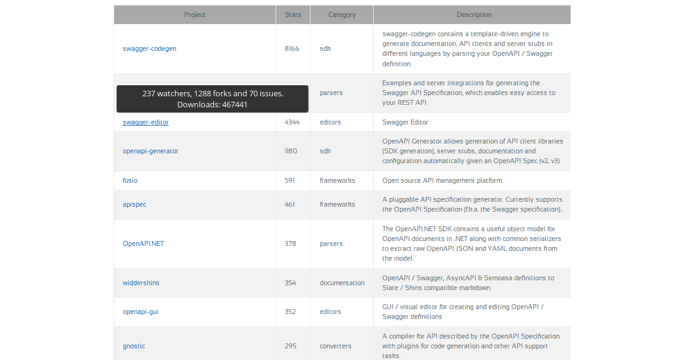

---

# OpenAPI Tool Discovery

Note:

First presented at API Days Paris, December 12th 2018.

---

---

### Me last week

---

## How I got into all this

---

## Finding OAS-related tools

* Swagger.IO has a list of v1/v2 implementations (https://swagger.io/tools/open-source/open-source-integrations/)
* OpenAPI Specification repository /IMPLEMENTATIONS.md (http://bit.do/oasv3-impl)

---

### Unofficial sites

* Awesome-OpenAPI3
* Creative Commons licensed

---

### More...

* OpenAPI.tools
* Content originally shared from Awesome-OpenAPI3

---

---

---

---

## APIDays Paris Exclusive

A look at the new Top100 page from APIs.guru awesome-openapi3

---

---

## Driven by...

a GraphQL query against GitHub's v4 API.

---

---

## Auto Categorisation

---

## Awesome-OpenAPI3 unique features

* API access
* RSS feed
* Schema.Org Product data for each tool

---

---

## Static site (jekyll/GitHub-pages)

* Updated weekly via Travis-CI cron job

---

## openapi.tools unique features

* Curated
* Opinionated
* Strict
* Coming soon: discussions / reviews

---

### Exclusive preview

---

## Quote from awesome-openapi3 repo

"Why not make your project discoverable by using the topic openapi3 on GitHub and using the hashtags #openapi3 and #OASv3 on social media?"

---

## Not in the hands of Kin Lane

### The API Evangelist...

---

Note:

http://discovery.apievangelist.com/2017/09/12/openapi-30-tooling-discovery-on-github-and-social-media/

---

</img>

---

</img>

---

### I should remember this when I think I haven't got anything to blog about

---

# Marketing 2.0

### "Relevancy or die!"

* All about connection
* Nobody succeeds by selling alone
* Authentic experiences and people, and part of customer journey
* Meaningful relationships

---

# Basically...

Blogging, social media, talks and presentations, meetups, GitHub topics etc.

---

## Facebook is a dead-zone, but Twitter and Mastodon are lively for APIs.

---

## Blogs

* The Practical Dev (https://dev.to) > medium

---

## And

Participating in unconferences

---

# Questions?
